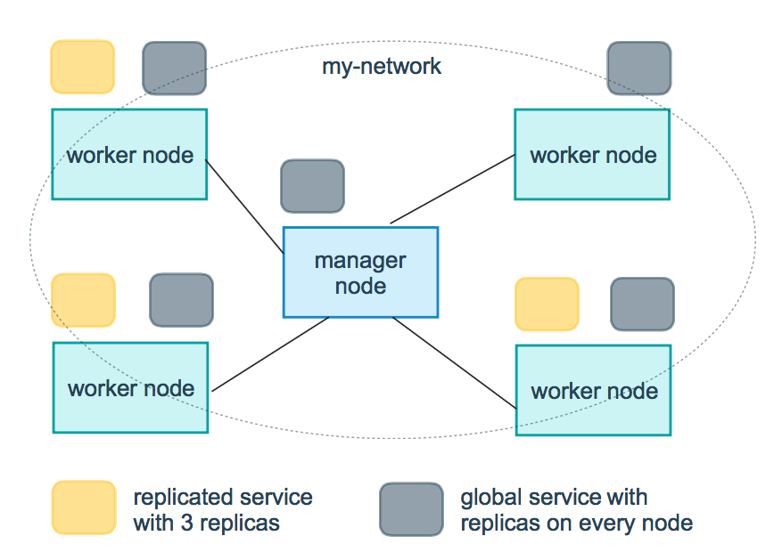

# docker
ps：容器化只有一个操作系统，隔离不同的进程
ps2：docker并不是容器，而是一个管理容器的引擎；
    运行机制：docker服务启动 -> 下载镜像 -> 启动该镜像得到一个容器 -> 容器里运行我们想要的程序

## todo
```shell script
FROM nginx:latest
RUN echo "This is my Nginx!!!"
#WORKDIR /usr/sbin/
COPY ./diy-test.txt /tmp/test/  #目录可以不存在
ENTRYPOINT ["nginx", "-g", "daemon off;"]

```

## 安装

### linux安装
```
sudo wget -qO- https://get.docker.com | sh
sudu usermod -aG docker imooc # 这个是允许非root用户来运行docker
```
或者参考：<https://www.runoob.com/docker/centos-docker-install.html>

#### 启动和停止命令
```
systemctl start docker
systemctl stop docker
systemctl restart docker
```

### docker命令
```
docker command-name --help 查看命令帮助

docker info 查看docker系统信息

docker 查看帮助信息

docker command --help 查看具体命令帮助信息

docker search img-name 搜索镜像；当然也可以在https://hub.docker.com搜索

docker pull img-name:tag 有些可以不加版本号tag
docker images [img-name] 显示本地所有或者具体镜像
docker rmi img-name 删除镜像

docker ps 查看当前运行的容器
    -a 查看所有容器
docker run img-name 新建一个容器
    -d 后台运行
    -p 真实端口:容器端口        ps：端口映射
    -e 设置环境变量            ps：具体的环境变量参数，在hub仓库中有说明
docker rm img-name 删除容器    ps：img-name可以改为容器id  
    -a 所有
    -q 只获取id，删除所有容器命令：docker rm $(docker ps -aq)  
docker exec -it contaner-id bash    ps：进入容器
    -i 交互式，打开标准输入流
    -t 虚拟控制台
docker start contaner-id 启动容器，重新挂载系统文件
docker stop contaner-id 停止容器，重新挂载系统文件
docker restart contaner-id 重启容器，不重新挂载系统文件
    -q 只获取id，停止所有容器命令：docker stop $(docker ps -q)
docker inspect contaner-id 容器更多信息

```

### mysql安装
参考：<https://www.cnblogs.com/linjiqin/p/11465804.html>

### 查询容器ip
```apacheconfig
docker inspect --format='{{.NetworkSettings.IPAddress}}' mysql01
```

### 安装mysql
a. 设置映射目录
```apacheconfig
docker run --restart=always --privileged=true -d -v /opt/mysql/data/:/var/lib/mysql -v /opt/mysql/conf.d:/etc/mysql/conf.d -v /opt/mysql/my.cnf:/etc/mysql/my.cnf -p 33060:3306 --name my-mysql -e MYSQL_ROOT_PASSWORD=123456 mysql
```
参考：<https://www.cnblogs.com/linjiqin/p/11465804.html>
报错：
```apacheconfig
2020-05-12T10:19:16.870032Z 0 [ERROR] [MY-010095] [Server] Failed to access directory for --secure-file-priv. Please make sure that directory exists and is accessible by MySQL Server. Supplied value : /var/lib/mysql-files
```
解决问题:
```apacheconfig
windows下：修改my.ini 在[mysqld]内加入secure_file_priv=/var/lib/mysql

linux下：修改my.cnf 在[mysqld]内加入secure_file_priv=/var/lib/mysql
```
### 运行nginx
```apacheconfig
docker run --name nginx-test -v E:\chao\sync2\WWW\docker:/usr/share/nginx/html:ro -p 8080:80 -d nginx
```
备注：<b>目录映射，宿主机的目录以及文件会覆盖容器中对应的目录</b>。
所以，如果映射的是配置文件目录，那么宿主机的配置文件目录里的文件就必须要存在

访问
```apacheconfig
http://localhost:8080/
```

### 安装php
```apacheconfig
docker pull php:7.3.5-fpm #注意这个也是非官方的
docker run --name  myphp-fpm -v E:\chao\sync2\WWW\docker:/www -d php:7.3.5-fpm
```

### nginx+php
```apacheconfig
docker run --name my-php-nginx -p 8083:80 -d -v E:\chao\sync2\WWW\docker:/usr/share/nginx/html:ro --link myphp-fpm:php nginx

或者
docker run --name runoob-php-nginx -p 8083:80 -d \
    -v E:\chao\sync2\WWW\docker:/usr/share/nginx/html:ro \
    -v E:\chao\sync2\WWW\etc\conf.d:/etc/nginx/conf.d:ro \
    ##把 myphp-fpm 的网络并入 nginx，并通过修改 nginx 的 /etc/hosts，
    #把域名 php 映射成 127.0.0.1，让 nginx 通过 php:9000 访问 php-fpm。
    #冒号后的php是myphp-fpm在nginx容器中的别名，在nginx配置文件的`fastcgi_pass   php:9000;`起作用
    --link myphp-fpm:php \  
    nginx
```
参考：<https://www.runoob.com/docker/docker-install-php.html>
备注：新起的nginx需要共享配置文件，如果不共享，容器里默认会建立/etc/nginx/conf.d/default.conf，
用域名localhost访问，可能会导致直接下载php文件，而不是解析。当然可以删除该文件，但最好还是
直接映射配置文件目录


### 自定义镜像
说明：Dockerfile文件内容分为四个部分
- 基础镜像信息：基于哪个镜像
- 维护者信息（可选）
- 镜像操作指令
- 容器启动时执行指令

`docker build -t nginx:v3 .`创建`nginx:v3`镜像


#### Dockerfile文件指令
总结分析
```
RUN         可以多条命令；但执行一次RUN，多加一层虚拟层
CMD         可以设置多条CMD，最后一条执行，可以为ENTRYPOINT提供参数；作为容器运行的主程序，主程序执行完，容器结束；
            启动容器时指定了运行程序，则被覆盖；
ENTRYPOINT  可以设置多条CMD，最后一条执行；作为容器运行的主程序，主程序执行完，容器结束
            不加--entrypoint：启动容器时指定了运行程序和参数，则ENTRYPOINT不会被覆盖，并且参数会给ENTRYPOINT声明的程序；
            加--entrypoint：此选项的参数可当作要运行的程序覆盖 ENTRYPOINT 指令指定的程序
```
- 建议：用CMD传递参数，用ENTRYPOINT指定程序；
- ps：如果指定了程序，在运行容器时运行程序，有点类似于shell子程序的感觉，直接标准输出

##### FROM :定制的镜像都是基于 FROM 的镜像
##### RUN：用于执行后面跟着的命令行命令。有以下俩种格式：
shell 格式：
```
RUN <命令行命令>
# <命令行命令> 等同于，在终端操作的 shell 命令。
exec 格式：

RUN ["可执行文件", "参数1", "参数2"]
例如：
# RUN ["./test.php", "dev", "offline"] 等价于 RUN ./test.php dev offline
```
**注意：Dockerfile 的指令每执行一次都会在 docker 上新建一层。所以过多无意义的层，会造成镜像膨胀过大。**

##### COPY
复制指令，从上下文目录中复制文件或者目录到容器里指定路径。
格式：
 ```
  
  COPY [--chown=<user>:<group>] <源路径1>...  <目标路径>
  COPY [--chown=<user>:<group>] ["<源路径1>",...  "<目标路径>"]
  [--chown=<user>:<group>]：可选参数，用户改变复制到容器内文件的拥有者和属组。
  
  <源路径>：源文件或者源目录，这里可以是通配符表达式，其通配符规则要满足 Go 的 filepath.Match 规则。例如：
  
  COPY hom* /mydir/
  COPY hom?.txt /mydir/
  <目标路径>：容器内的指定路径，该路径不用事先建好，路径不存在的话，会自动创建。
``` 

##### ADD
ADD 指令和 COPY 的使用格式一致（同样需求下，官方推荐使用 COPY）。功能也类似，不同之处如下：

ADD 的优点：在执行 <源文件> 为 tar 压缩文件的话，压缩格式为 gzip, bzip2 以及 xz 的情况下，会自动复制并解压到 <目标路径>。
ADD 的缺点：在不解压的前提下，无法复制 tar 压缩文件。会令镜像构建缓存失效，从而可能会令镜像构建变得比较缓慢。
具体是否使用，可以根据是否需要自动解压来决定。

##### CMD
类似于 RUN 指令，用于运行程序，但二者运行的时间点不同:

CMD 在docker run 时运行。
RUN 是在 docker build。
作用：为启动的容器指定默认要运行的程序，程序运行结束，容器也就结束。CMD 指令指定的程序可被 docker run 命令行参数中指定要运行的程序所覆盖。

注意：如果 Dockerfile 中如果存在多个 CMD 指令，仅最后一个生效。
格式：
``` 

CMD <shell 命令> 
CMD ["<可执行文件或命令>","<param1>","<param2>",...] 
CMD ["<param1>","<param2>",...]  # 该写法是为 ENTRYPOINT 指令指定的程序提供默认参数
``` 
推荐使用第二种格式，执行过程比较明确。第一种格式实际上在运行的过程中也会自动转换成第二种格式运行，并且默认可执行文件是 sh。

##### ENTRYPOINT

类似于 CMD 指令，但其不会被 docker run 的命令行参数指定的指令所覆盖，而且这些命令行参数会被当作参数送给 ENTRYPOINT 指令指定的程序。

但是, 如果运行 docker run 时使用了 --entrypoint 选项，此选项的参数可当作要运行的程序覆盖 ENTRYPOINT 指令指定的程序。

优点：在执行 docker run 的时候可以指定 ENTRYPOINT 运行所需的参数。

**注意：如果 Dockerfile 中如果存在多个 ENTRYPOINT 指令，仅最后一个生效。**

格式：
``` 

ENTRYPOINT ["<executeable>","<param1>","<param2>",...]
``` 
可以搭配 CMD 命令使用：一般是变参才会使用 CMD ，这里的 CMD 等于是在给 ENTRYPOINT 传参，以下示例会提到。

示例：

假设已通过 Dockerfile 构建了 nginx:test 镜像：
``` 
FROM nginx

ENTRYPOINT ["nginx", "-c"] # 定参
CMD ["/etc/nginx/nginx.conf"] # 变参 
``` 
1、不传参运行

`$ docker run  nginx:test`
容器内会默认运行以下命令，启动主进程。

`nginx -c /etc/nginx/nginx.conf`

2、传参运行

`$ docker run  nginx:test -c /etc/nginx/new.conf`
容器内会默认运行以下命令，启动主进程(`/etc/nginx/new.conf`:假设容器内已有此文件)

`nginx -c /etc/nginx/new.conf`

##### ENV
设置环境变量，定义了环境变量，那么在后续的指令中，就可以使用这个环境变量。
格式：
``` 
ENV <key> <value>
ENV <key1>=<value1> <key2>=<value2>...
``` 
以下示例设置 NODE_VERSION = 7.2.0 ， 在后续的指令中可以通过 $NODE_VERSION 引用：
```
ENV NODE_VERSION 7.2.0

RUN curl -SLO "https://nodejs.org/dist/v$NODE_VERSION/node-v$NODE_VERSION-linux-x64.tar.xz" \
  && curl -SLO "https://nodejs.org/dist/v$NODE_VERSION/SHASUMS256.txt.asc"
```
##### ARG
构建参数，与 ENV 作用一至。不过作用域不一样。ARG 设置的环境变量仅对 Dockerfile 内有效，也就是说只有 docker build 的过程中有效，构建好的镜像内不存在此环境变量。

构建命令 docker build 中可以用 --build-arg <参数名>=<值> 来覆盖。

格式：

`ARG <参数名>[=<默认值>]`

##### VOLUME
定义匿名数据卷。在启动容器时忘记挂载数据卷，会自动挂载到匿名卷。

作用：

避免重要的数据，因容器重启而丢失，这是非常致命的。
避免容器不断变大。
格式：
```
VOLUME ["<路径1>", "<路径2>"...]
VOLUME <路径>
```
在启动容器 `docker run` 的时候，我们可以通过 `-v` 参数修改挂载点。

##### EXPOSE
仅仅只是声明端口。

作用：

帮助镜像使用者理解这个镜像服务的守护端口，以方便配置映射。
在运行时使用随机端口映射时，也就是 docker run -P 时，会自动随机映射 EXPOSE 的端口。
格式：

`EXPOSE <端口1> [<端口2>...]`

##### WORKDIR

指定工作目录。用 WORKDIR 指定的工作目录，会在构建镜像的每一层中都存在。（WORKDIR 指定的工作目录，必须是提前创建好的）。

docker build 构建镜像过程中的，每一个 RUN 命令都是新建的一层。只有通过 WORKDIR 创建的目录才会一直存在。

格式：

`WORKDIR <工作目录路径>`

##### USER
用于指定执行后续命令的用户和用户组，这边只是切换后续命令执行的用户（用户和用户组必须提前已经存在）。

格式：

`USER <用户名>[:<用户组>]`

##### HEALTHCHECK
用于指定某个程序或者指令来监控 docker 容器服务的运行状态。

格式：
```
HEALTHCHECK [选项] CMD <命令>：设置检查容器健康状况的命令
HEALTHCHECK NONE：如果基础镜像有健康检查指令，使用这行可以屏蔽掉其健康检查指令

HEALTHCHECK [选项] CMD <命令> : 这边 CMD 后面跟随的命令使用，可以参考 CMD 的用法。
```

##### ONBUILD

用于延迟构建命令的执行。简单的说，就是 Dockerfile 里用 ONBUILD 指定的命令，在本次构建镜像的过程中不会执行（假设镜像为 test-build）。
当有新的 Dockerfile 使用了之前构建的镜像 FROM test-build ，这是执行新镜像的 Dockerfile 构建时候，
会执行 test-build 的 Dockerfile 里的 ONBUILD 指定的命令。

格式：

`ONBUILD <其它指令>`


eg：
```
FROM nginx:latest
RUN echo "This is my Nginx!!!"  # 直接标准输出，但是windows这边通不过，linux可以
# WORKDIR /usr/sbin/            # 设置容器中的当前工作目录，有点类似于`cd dir-name`的作用
COPY ./diy-test.txt /tmp/test/  # 目录可以不存在，拷贝Dockerfile文件所在目录的diy-test.txt到容器的/tmp/test/
EXPOSE 80                       # 仅仅是声明容器打算使用什么端口而已，并不会自动在宿主进行端口映射。应该需要配合`docker run -p`使用
ENTRYPOINT ["nginx", "-g", "daemon off;"]
```
使用命令`docker build -t nginx:v3 .`创建`nginx:v3`镜像

## 阿里云镜像仓库
阿里云都有示例
访问：<https://cr.console.aliyun.com/cn-hangzhou/instances/repositories>


## Docker Compose
Compose 是用于定义和运行多容器 Docker 应用程序的工具。
通过 Compose，您可以使用 YML 文件来配置应用程序需要的所有服务。
然后，使用一个命令，就可以从 YML 文件配置中创建并启动所有服务。

### 命令
```shell script
docker-compose up -d  # 在后台启动服务，`-d`是守护进程
docker-compose -f docker-compose.yml up -d  # -f  指定使用的 Compose 模板文件，默认为 docker-compose.yml，可以多次指定，指定多个yml。
docker-compose config  -q #验证（docker-compose.yml）文件配置，当配置正确时，不输出任何内容，当文件配置错误，输出错误信息。 
docker-compose ps   # 查看启动的服务
docker-compose ps eureka  # 列出指定服务的容器

docker-compose start # 启动项目中的服务，，重新挂载文件系统
docker-compose stop # 停止已经处于运行状态的容器，但不删除它。 docker-compose start 可以再次启动这些容器。

docker-compose down # 停用移除所有容器以及网络相关
docker-compose rm # 删除所有（停止状态的）服务容器。推荐先执行 docker-compose stop 命令来停止容器。

docker-compose logs  nginx       # 查看nginx的日志 
docker-compose logs -f nginx     # 查看nginx的实时日志
docker-compose events --json nginx # 以json的形式输出nginx的docker日志
docker-compose logs # 查看服务容器的输出

docker-compose exec nginx bash # 进入容器，如登录到nginx容器中

# 构建（重新构建）项目中的服务容器。服务容器一旦构建后，将会带上一个标记名，例如对于 web 项目中的一个 db 容器，可能是 web_db。可以随时在项目目录下运行 docker-compose build 来重新构建服务
docker-compose build 
docker-compose build --no-cache nginx # 不带缓存的构建

docker-compose pull # 拉取服务依赖的镜像

docker-compose run ubuntu ping docker.com # 在指定服务上执行一个命令。
docker-compose run --no-deps --rm php-fpm php -v # 在php-fpm中不启动关联容器，并容器执行php -v 执行完成后删除容器

docker-compose pause nginx        # 暂停nignx容器
docker-compose unpause nginx      # 恢复ningx容器
docker-compose kill eureka      # 通过发送SIGKILL信号停止指定服务的容器

docker-compose --help # 帮助
```

### 安装
说明：linux上docker-compose需要单独安装
1、安装docker-compose（官网：<https://github.com/docker/compose/releases>）
参考：<https://www.runoob.com/docker/docker-compose.html>
安装：
```
curl -L https://github.com/docker/compose/releases/download/1.25.0/docker-compose-`uname -s`-`uname -m` -o /usr/local/bin/docker-compose
curl -L https://github.com/docker/compose/releases/download/1.25.0/docker-compose-Linux-x86_64 -o /usr/local/bin/docker-compose   # 等效上面的命令
chmod +x /usr/local/bin/docker-compose
```
查看版本：

`docker-compose --version`
2、docker-compose常用命令
```
docker-compose -h                           # 查看帮助

docker-compose up                           # 创建并运行所有容器
docker-compose up -d                        # 创建并后台运行所有容器
docker-compose -f docker-compose.yml up -d  # 指定模板
docker-compose down                         # 停止并删除容器、网络、卷、镜像。

docker-compose logs       # 查看容器输出日志
docker-compose pull       # 拉取依赖镜像
dokcer-compose config     # 检查配置
dokcer-compose config -q  # 检查配置，有问题才有输出

docker-compose restart   # 重启服务，不重新挂载文件系统
docker-compose start     # 启动服务，重新挂载文件系统
docker-compose stop      # 停止服务
```

### 使用
Compose 使用的三个步骤：
- 使用 Dockerfile 定义应用程序的环境。

- 使用 docker-compose.yml 定义构成应用程序的服务，这样它们可以在隔离环境中一起运行。

- 最后，执行 docker-compose up 命令来启动并运行整个应用程序。

eg：docker-compose.yml 的配置案例如下（配置参数参考下文）：
```
# yaml 配置实例
version: '3'
services:
  web:
    build: .
    ports:
   - "5000:5000"
    volumes:
   - .:/code
    - logvolume01:/var/log
    links:
   - redis
  redis:
    image: redis
volumes:
  logvolume01: {}
```


### yml 配置指令参考
#### version
    指定本 yml 依从的 compose 哪个版本制定的。
    
#### build
指定为构建镜像上下文路径：

例如 webapp 服务，指定为从上下文路径 ./dir/Dockerfile 所构建的镜像：
```
version: "3.7"
services:
  webapp:
    build: ./dir
```
或者，作为具有在上下文指定的路径的对象，以及可选的 Dockerfile 和 args：
```
version: "3.7"
services:
  webapp:
    build:
      context: ./dir
      dockerfile: Dockerfile-alternate
      args:
        buildno: 1
      labels:
        - "com.example.description=Accounting webapp"
        - "com.example.department=Finance"
        - "com.example.label-with-empty-value"
      target: prod
```
- context：上下文路径。
- dockerfile：指定构建镜像的 Dockerfile 文件名。
- args：添加构建参数，这是只能在构建过程中访问的环境变量。
- labels：设置构建镜像的标签。
- target：多层构建，可以指定构建哪一层。

#### cap_add，cap_drop
    添加或删除容器拥有的宿主机的内核功能。
```    
cap_add:
  - ALL # 开启全部权限

cap_drop:
  - SYS_PTRACE # 关闭 ptrace权限
```
#### cgroup_parent
为容器指定父 cgroup 组，意味着将继承该组的资源限制。
```    
    cgroup_parent: m-executor-abcd
```
#### command
覆盖容器启动的默认命令。
```
command: ["bundle", "exec", "thin", "-p", "3000"]
```
#### container_name
指定自定义容器名称，而不是生成的默认名称。
```
container_name: my-web-container
```
#### depends_on
设置依赖关系。
- docker-compose up ：以依赖性顺序启动服务。在以下示例中，先启动 db 和 redis ，才会启动 web。
- docker-compose up SERVICE ：自动包含 SERVICE 的依赖项。在以下示例中，docker-compose up web 还将创建并启动 db 和 redis。
- docker-compose stop ：按依赖关系顺序停止服务。在以下示例中，web 在 db 和 redis 之前停止。
```

version: "3.7"
services:
  web:
    build: .
    depends_on:
      - db
      - redis
  redis:            # 自定义名称
    image: redis
  db:
    image: postgres
```
注意：web 服务不会等待 redis db 完全启动 之后才启动。
    
#### deploy
指定与服务的部署和运行有关的配置。只在 swarm 模式下才会有用。
```   
version: "3.7"
services:
  redis:
    image: redis:alpine
    deploy:
      mode：replicated
      replicas: 6
      endpoint_mode: dnsrr
      labels: 
        description: "This redis service label"
      resources:
        limits:
          cpus: '0.50'
          memory: 50M
        reservations:
          cpus: '0.25'
          memory: 20M
      restart_policy:
        condition: on-failure
        delay: 5s
        max_attempts: 3
        window: 120s
``` 


可以选参数：

##### endpoint_mode：访问集群服务的方式。
``` 
endpoint_mode: vip 
# Docker 集群服务一个对外的虚拟 ip。所有的请求都会通过这个虚拟 ip 到达集群服务内部的机器。
endpoint_mode: dnsrr
# DNS 轮询（DNSRR）。所有的请求会自动轮询获取到集群 ip 列表中的一个 ip 地址。
``` 
##### labels
在服务上设置标签。可以用容器上的 labels（跟 deploy 同级的配置） 覆盖 deploy 下的 labels。
    
##### mode：指定服务提供的模式。
    
- replicated：复制服务，复制指定服务到集群的机器上。

- global：全局服务，服务将部署至集群的每个节点。

- 图解：下图中黄色的方块是 replicated 模式的运行情况，灰色方块是 global 模式的运行情况。
  
    
    
##### replicas：mode 为 replicated 时，需要使用此参数配置具体运行的节点数量。
    
##### resources：配置服务器资源使用的限制，例如上例子，配置 redis 集群运行需要的 cpu 的百分比 和 内存的占用。避免占用资源过高出现异常。
    
##### restart_policy：配置如何在退出容器时重新启动容器。
    
- condition：可选 none，on-failure 或者 any（默认值：any）。
- delay：设置多久之后重启（默认值：0）。
- max_attempts：尝试重新启动容器的次数，超出次数，则不再尝试（默认值：一直重试）。
- window：设置容器重启超时时间（默认值：0）。
##### rollback_config：配置在更新失败的情况下应如何回滚服务。
    
- parallelism：一次要回滚的容器数。如果设置为0，则所有容器将同时回滚。
- delay：每个容器组回滚之间等待的时间（默认为0s）。
- failure_action：如果回滚失败，该怎么办。其中一个 continue 或者 pause（默认pause）。
- monitor：每个容器更新后，持续观察是否失败了的时间 (ns|us|ms|s|m|h)（默认为0s）。
- max_failure_ratio：在回滚期间可以容忍的故障率（默认为0）。
- order：回滚期间的操作顺序。其中一个 stop-first（串行回滚），或者 start-first（并行回滚）（默认 stop-first ）。
##### update_config：配置应如何更新服务，对于配置滚动更新很有用。
    
- parallelism：一次更新的容器数。
- delay：在更新一组容器之间等待的时间。
- failure_action：如果更新失败，该怎么办。其中一个 continue，rollback 或者pause （默认：pause）。
- monitor：每个容器更新后，持续观察是否失败了的时间 (ns|us|ms|s|m|h)（默认为0s）。
- max_failure_ratio：在更新过程中可以容忍的故障率。
- order：回滚期间的操作顺序。其中一个 stop-first（串行回滚），或者 start-first（并行回滚）（默认stop-first）。
注：仅支持 V3.4 及更高版本。
    
#### devices
    指定设备映射列表。
```    
devices:
  - "/dev/ttyUSB0:/dev/ttyUSB0"
``` 
#### dns
自定义 DNS 服务器，可以是单个值或列表的多个值。

dns: 8.8.8.8

dns:
  - 8.8.8.8
  - 9.9.9.9
#### dns_search
自定义 DNS 搜索域。可以是单个值或列表。

dns_search: example.com

dns_search:
  - dc1.example.com
  - dc2.example.com
#### entrypoint
覆盖容器默认的 entrypoint。

`entrypoint: /code/entrypoint.sh`
也可以是以下格式：
``` 
entrypoint:
    - php
    - -d
    - zend_extension=/usr/local/lib/php/extensions/no-debug-non-zts-20100525/xdebug.so
    - -d
    - memory_limit=-1
    - vendor/bin/phpunit
``` 
#### env_file
从文件添加环境变量。可以是单个值或列表的多个值。

`env_file: .env`
也可以是列表格式：
``` 
env_file:
  - ./common.env
  - ./apps/web.env
  - /opt/secrets.env
``` 
#### environment
    添加环境变量。您可以使用数组或字典、任何布尔值，布尔值需要用引号引起来，以确保 YML 解析器不会将其转换为 True 或 False。
``` 
environment:
  RACK_ENV: development
  SHOW: 'true'
expose
``` 
暴露端口，但不映射到宿主机，只被连接的服务访问。

仅可以指定内部端口为参数：
    
#### expose:
``` 
 - "3000"
 - "8000"
extra_hosts
``` 
添加主机名映射。类似 docker client --add-host。
    
#### extra_hosts:
``` 
 - "somehost:162.242.195.82"
 - "otherhost:50.31.209.229"
``` 
以上会在此服务的内部容器中 /etc/hosts 创建一个具有 ip 地址和主机名的映射关系：
``` 
162.242.195.82  somehost
50.31.209.229   otherhost
``` 

#### healthcheck
用于检测 docker 服务是否健康运行。
```
healthcheck:
      test: ["CMD", "curl", "-f", "http://localhost"] # 设置检测程序，这个检查程序可以自定义，返回0为成功，1为失败
      interval: 1m30s # 设置检测间隔
      timeout: 10s # 设置检测超时时间
      retries: 3 # 设置重试次数
      start_period: 40s # 启动后，多少秒开始启动检测程序
```
和 `CMD`, `ENTRYPOINT` 一样，`HEALTHCHECK` 只可以出现一次，如果写了多个，只有最后一个生效。

在 `HEALTHCHECK [选项] CMD 后面的命令`，格式和 `ENTRYPOINT` 一样，分为 shell 格式，和 exec 格式。命令的返回值决定了该次健康检查的成功与否：0：成功；1：失败；2：保留，不要使用这个值。

假设我们有个镜像是个最简单的 Web 服务，我们希望增加健康检查来判断其 Web 服务是否在正常工作，我们可以用 curl 来帮助判断，其 Dockerfile 的 HEALTHCHECK 可以这么写：
```
FROM nginx
RUN apt-get update && apt-get install -y curl && rm -rf /var/lib/apt/lists/*
HEALTHCHECK --interval=5s --timeout=3s \
  CMD curl -fs http://localhost/ || exit 1
```
这里我们设置了每 5 秒检查一次（这里为了试验所以间隔非常短，实际应该相对较长），如果健康检查命令超过 3 秒没响应就视为失败，并且使用 curl -fs http://localhost/ || exit 1 作为健康检查命令。
参考：<https://www.cntofu.com/book/139/image/dockerfile/healthcheck.md>
#### image
指定容器运行的镜像。以下格式都可以：
```    
image: redis
image: ubuntu:14.04
image: tutum/influxdb
image: example-registry.com:4000/postgresql
image: a4bc65fd # 镜像id
```
ps：image参数可以设置远程地址，如：`image: registry.cn-hangzhou.aliyuncs.com/neo1303582949/test:v0.1`

#### logging
服务的日志记录配置。

driver：指定服务容器的日志记录驱动程序，默认值为json-file。有以下三个选项
```
driver: "json-file"
driver: "syslog"
driver: "none"
```
仅在 json-file 驱动程序下，可以使用以下参数，限制日志得数量和大小。
```
logging:
  driver: json-file
  options:
    max-size: "200k" # 单个文件大小为200k
    max-file: "10" # 最多10个文件
```
当达到文件限制上限，会自动删除旧得文件。

syslog 驱动程序下，可以使用 syslog-address 指定日志接收地址。
```
logging:
  driver: syslog
  options:
    syslog-address: "tcp://192.168.0.42:123"
```
#### network_mode
设置网络模式。
```
network_mode: "bridge"
network_mode: "host"
network_mode: "none"
network_mode: "service:[service name]"
network_mode: "container:[container name/id]"
networks
```
配置容器连接的网络，引用顶级 networks 下的条目 。
```
services:
  some-service:
    networks:
      some-network:
        aliases:
         - alias1
      other-network:
        aliases:
         - alias2
networks:
  some-network:
    # Use a custom driver
    driver: custom-driver-1
  other-network:
    # Use a custom driver which takes special options
    driver: custom-driver-2
```
aliases ：同一网络上的其他容器可以使用服务名称或此别名来连接到对应容器的服务。
    
#### restart
- no：是默认的重启策略，在任何情况下都不会重启容器。
- always：容器总是重新启动。
- on-failure：在容器非正常退出时（退出状态非0），才会重启容器。
- unless-stopped：在容器退出时总是重启容器，但是不考虑在Docker守护进程启动时就已经停止了的容器
```
restart: "no"
restart: always
restart: on-failure
restart: unless-stopped
```
注：swarm 集群模式，请改用 restart_policy。

#### secrets
存储敏感数据，例如密码：
```
version: "3.1"
services:

mysql:
  image: mysql
  environment:
    MYSQL_ROOT_PASSWORD_FILE: /run/secrets/my_secret
  secrets:
    - my_secret

secrets:
  my_secret:
    file: ./my_secret.txt
```
#### security_opt
    修改容器默认的 schema 标签。
``` 
security-opt：
  - label:user:USER   # 设置容器的用户标签
  - label:role:ROLE   # 设置容器的角色标签
  - label:type:TYPE   # 设置容器的安全策略标签
  - label:level:LEVEL  # 设置容器的安全等级标签
```
#### stop_grace_period
    指定在容器无法处理 SIGTERM (或者任何 stop_signal 的信号)，等待多久后发送 SIGKILL 信号关闭容器。
```   
stop_grace_period: 1s # 等待 1 秒
stop_grace_period: 1m30s # 等待 1 分 30 秒 
```
    默认的等待时间是 10 秒。
    
#### stop_signal
设置停止容器的替代信号。默认情况下使用 SIGTERM 。

以下示例，使用 SIGUSR1 替代信号 SIGTERM 来停止容器。

`stop_signal: SIGUSR1`
#### sysctls
设置容器中的内核参数，可以使用数组或字典格式。
```
sysctls:
  net.core.somaxconn: 1024
  net.ipv4.tcp_syncookies: 0

sysctls:
  - net.core.somaxconn=1024
  - net.ipv4.tcp_syncookies=0
```
#### tmpfs
在容器内安装一个临时文件系统。可以是单个值或列表的多个值。
```
tmpfs: /run

tmpfs:
  - /run
  - /tmp
```
#### ulimits
    覆盖容器默认的 ulimit。
```    
ulimits:
  nproc: 65535
  nofile:
    soft: 20000
    hard: 40000
```
#### volumes
    将主机的数据卷或着文件挂载到容器里。
```    
version: "3.7"
services:
  db:
    image: postgres:latest
    volumes:
      - "/localhost/postgres.sock:/var/run/postgres/postgres.sock"
      - "/localhost/data:/var/lib/postgresql/data"
```

### 示例
#### docker-compose.yaml

```yaml
version: '3'
services:
  web:
    image: registry.cn-hangzhou.aliyuncs.com/neo1303582949/prod-nginx:v1.0
    ports:
      # 真假-对应着真实的物理机端口，以及容器内端口
      - "80:80"
    container_name: "my_nginx"
    command: [nginx, '-g', 'daemon off;']
    environment:
      - NGINX_HOST=haha.com
      # 猜测：这个端口可能是nginx监听端口
      - NGINX_PORT=80
    volumes:
      # 真假-真实物理机目录，对应着容器内目录
      - 'C:\chao\sync2\backend\docker\docker-compose\services\nginx\www:/usr/share/nginx/html'
      - 'C:\chao\sync2\backend\docker\docker-compose\services\nginx\conf.d:/etc/nginx/conf.d'
    #    restart: always
    links:
      # 这样设置，nginx的配置文件中需要访问php-fpm所在的容器时，ip地址可以用php代替
      - php:php
    networks:
      dev:
        # 用来固定ip
        ipv4_address: 172.19.0.2
    labels:
      - "diy information in docker inspect"
    depends_on:
      - php
  php:
    image: registry.cn-hangzhou.aliyuncs.com/neo1303582949/prod-php:v0.5
    ports:
      - "9000:9000"
    container_name: "my_php_fpm"
    networks:
      dev:
        # 用来固定ip
        ipv4_address: 172.19.0.3
      #- pro
    volumes:
      # 注意：放置php文件的目录映射要与nginx中的配置文件`fastcgi_param  SCRIPT_FILENAME  /usr/share/nginx/html/$fastcgi_script_name;`一致
      #      /usr/share/nginx/html是nginx容器中放置php文件的位置，即使现在在php容器中，依然用这个位置
      - 'C:\chao\sync2\backend\docker\docker-compose\services\nginx\www:/usr/share/nginx/html'
  mysql:
    image: mysql:5.7.32
    environment:
      MYSQL_ROOT_PASSWORD: "L@123." #为数据库的密码，也就是root用户的密。
      MYSQL_USER: 'test'
      MYSQL_PASS: 'L@123.'
      TZ: 'Asia/Shanghai'
      #MYSQL_DATABASE:'diy-database' #指定一个数据库，在容器启动时创建
    # restart: always
    volumes:
      # 只有mysql版本相同，映射的数据才能用
      - 'C:\chao\sync2\backend\docker\docker-compose\services\mysql\data:/var/lib/mysql'
      # /etc/mysql是默认安装的配置文件目录，一般不要乱设置哦
      - 'C:\chao\sync2\backend\docker\docker-compose\services\mysql\etc:/etc/mysql' #注意目录对应关系
      - 'C:\chao\sync2\backend\docker\docker-compose\services\mysql\init:/docker-entrypoint-initdb.d/'
    ports:
      - "3306:3306"
    container_name: "my_mysql"
    networks:
      dev:
        # 用来固定ip
        ipv4_address: 172.19.0.4
  redis:
    image: redis:5.0.10-alpine
    container_name: "my_redis"
    ports:
      # 端口映射
      - 6379:6379
    networks:
      dev:
        # 用来固定ip
        ipv4_address: 172.19.0.5
    volumes:
      # 持久化 目录映射
      - 'C:\chao\sync2\backend\docker\docker-compose\services\redis\conf:/usr/local/etc/redis'
      - 'C:\chao\sync2\backend\docker\docker-compose\services\redis\data:/data'
    command: ['redis-server', '/usr/local/etc/redis/redis.conf']
networks:
  dev:
    # 引擎根据系统不同，通过命令`docker network ls`，查看系统具体支持哪一种网络，有bridge，nat等
    driver: nat
    ipam:
      config:
        - subnet: 172.19.0.0/16

  #pro:
  #  driver: nat
```
#### 对应目录结构
示例中的目录结构在`C:\chao\sync2\backend\docker\docker-compose\services`中演示

#### 运行命令
```shell script
docker-compose up -d
```

#### 安装php扩展
##### 方式一
```shell script
pecl install redis
```
##### 方式二（采用）
参考：<https://www.cnblogs.com/yinguohai/p/11329273.html>
说明：docker-php-ext-source系列命令是docker的php容器自带的，自定义的php容器不一定有；
参考：<https://hub.docker.com/_/php>

备注：如果操作网速慢，可以更改镜像源
`sed -i 's/dl-cdn.alpinelinux.org/mirrors.aliyun.com/g' /etc/apk/repositories`

- 命令：`docker-php-source extract | delete`
    
    参数说明：
    * extract : 创建并初始化 /usr/src/php目录
    * delete : 删除 /usr/src/php目录
示例：安装xdebug
```shell script
/tmp # curl -L -o /tmp/xdebug.tar.gz https://xdebug.org/files/xdebug-2.9.8.tgz
/tmp # tar -xzf xdebug.tar.gz
/tmp# docker-php-source extract   # 如果第一次用来安装php扩展的话，需要使用这个命令创建并初始化/usr/src/php目录
/tmp # mv xdebug-2.9.8 /usr/src/php/ext/xdebug
/tmp # docker-php-ext-install xdebug
```
备注：php的版本对xdebug的版本敏感，有对应，这里使用php7.4对应xdebug-2.9.8
备注：php容器安装好xdebug后在容器`/usr/local/etc/php/conf.d/docker-php-ext-xdebug.ini`中添加内容
```ini
zend_extension=xdebug.so
xdebug.mode=debug
;开启xdebug支持远程调试
xdebug.remote_enable=1
;远程调试的主机，一般都是docker宿主机器，本地调试就是本机，ip可以通过`docker inspect 容器名获得`
xdebug.remote_host=192.168.56.1
;远程调试机器的端口，一般是9000，和后面讲到的phpStorm里面保持一致
xdebug.remote_port=9999
;idekey 对接调试的密钥，和后面phpStorm里面的务必保持一致
xdebug.idekey=PHPSTORM
;自动触发调试，可以将这个值设为1；
xdebug.remote_autostart=1
;更多参数介绍请参见这里 https://xdebug.org/docs/all_settings
xdebug.remote_connect_back=1
;xdebug.remote_handler=dbgp Available in Xdebug < 2.9
xdebug.remote_handler=dbgp
xdebug.max_nesting_level=250
```
说明：如果直接vim编辑有问题，
     可以直接使用` docker cp docker-php-ext-xdebug.ini 707bebcd67d8:/usr/local/etc/php/conf`
额外：需要再phpstorm中file > Setting > Languages & Frameworks > PHP > Debug页面中更改Debug port为9999
      然后 不需要 在浏览器中添加`XDEBUG_SESSION`的cookie了；直接打断点，浏览器访问地址即可；
      猜测原理：应该是访问服务器后，php的xdebug模块根据`xdebug.remote_host:xdebug.remote_port`触发phpstorm中
               断点起作用；


- 命令：`docker-php-ext-enable`
    
    这个命令，就是用来启动 PHP扩展 的。我们使用pecl安装PHP扩展的时候，默认是没有启动这个扩展的，
    如果想要使用这个扩展必须要在php.ini这个配置文件中去配置一下才能使用这个PHP扩展。
    而 docker-php-ext-enable 这个命令则是自动给我们来启动PHP扩展的，
    不需要你去php.ini这个配置文件中去配置。

- 命令：`docker-php-ext-install`

  这个命令，是用来安装并启动PHP扩展的。
  命令格式：
  docker-php-ext-install “源码包目录名”
  
  注意点：
  “源码包“需要放在 `/usr/src/php/ext`下
  默认情况下，PHP容器没有 /usr/src/php这个目录，需要使用 docker-php-source extract来生成。
  docker-php-ext-install 安装的扩展在安装完成后，会自动调用docker-php-ext-enable来启动安装的扩展。
  卸载扩展，直接删除/usr/local/etc/php/conf.d 对应的配置文件即可。

- 命令：`docker-php-ext-configure`
     
     docker-php-ext-configure 一般都是需要跟 docker-php-ext-install搭配使用的。
     它的作用就是，当你安装扩展的时候，需要自定义配置时，就可以使用它来帮你做到。


#### 卸载php扩展
1. 删除`/usr/src/php/ext/xdebug`
2. 删除`/usr/local/etc/php/conf.d/docker-php-ext-xdebug.ini`

#### 调整php.ini参数
说明：官方php:fpm-alpine系列的容器，php配置文件在`/usr/local/etc/php/php.ini`和`/usr/local/etc/php/conf.d`中
     后者覆盖

示例
现在在项目中需要上传文件，但是镜像提供的php的上传配置都是：
```
upload_max_filesize=2M
post_max_size=2M
```

明显不足，所以需要修改下配置文件，但是找了半天没有找到 php.ini 的配置文件在哪里，最终，可以这样操作：
```shell script
cd /usr/local/etc/php/conf.d
vi upload.ini
```
输入下面的内容：
```
upload_max_filesize=100M
post_max_size=100M
```
这样，就配置完成了。为什么这样可以呢？因为 `/usr/local/etc/php/conf.d` 目录下面的 `ini` 配置文件会自动加载的。

备注：还要运用`docker stop xxx`和`docker start xxx`配合，以重新加载配置文件；千万不要使用`docker restart`哦，
     这个不会重新挂载文件系统


#### 调整php-fmp参数
说明：修改`/usr/local/etc/php-fpm.conf`以及`/usr/local/etc/php-fpm.d`的配置更改，然后
     运用`docker stop xxx`和`docker start xxx`配合使用即可

#### 设置nginx的配置文件
说明：修改`/etc/nginx/conf.d`中配置文件，基本同上


## 镜像

### 列出镜像列表
命令：`docker images`

### 利用镜像创建容器
命令：`docker run -t -i ubuntu:latest /bin/bash`
参数说明：

    -i: 交互式操作。
    -t: 终端。
    ubuntu:15.10: 这是指用 ubuntu 15.10 版本镜像为基础来启动容器。
    /bin/bash：放在镜像名后的是命令，这里我们希望有个交互式 Shell，因此用的是 /bin/bash。

### 获取一个新的镜像
说明：当我们在本地主机上使用一个不存在的镜像时 Docker 就会自动下载这个镜像。
     如果我们想预先下载这个镜像，我们可以使用 docker pull 命令来下载它。
命令：`docker pull ubuntu:13.10`

### 推送镜像
说明：将本地的镜像上传到镜像仓库,要先登陆到镜像仓库；当然前提是得先登录仓库
命令：`docker push [OPTIONS] NAME[:TAG]`
OPTIONS说明：

    --disable-content-trust :忽略镜像的校验,默认开启

实例
上传本地镜像`registry.cn-hangzhou.aliyuncs.com/neo1303582949/test:v0.2`到镜像仓库中。
```
docker push registry.cn-hangzhou.aliyuncs.com/neo1303582949/test:v0.2
```
注意：仓库是完整镜像；如果本地命名和标签不是`registry.cn-hangzhou.aliyuncs.com/neo1303582949/test:v0.2`
     需要将本地仓库重新命名为线上仓库镜像名（一个仓库只有一个系列的镜像，如：nginx系列）
     `docker tag 99d70db32094 registry.cn-hangzhou.aliyuncs.com/neo1303582949/test:v0.2`


### 查找镜像
命令：`docker search [container-name]`

### 删除镜像
命令：`docker rmi [container-name]`

### 创建镜像
当我们从 docker 镜像仓库中下载的镜像不能满足我们的需求时，我们可以通过以下两种方式对镜像进行更改。

1、从已经创建的容器中更新镜像，并且提交这个镜像
2、使用 Dockerfile 指令来创建一个新的镜像

#### 更新镜像（创建镜像）
说明：在更改容器后，想要保存为镜像
命令：`docker commit -m="has update" -a="runoob" e218edb10161 runoob/ubuntu:v2`

    -m: 提交的描述信息
    -a: 指定镜像作者
    e218edb10161：容器 ID
    runoob/ubuntu:v2: 指定要创建的目标镜像名


#### 构建镜像

我们使用命令 `docker build` ， 从零开始来创建一个新的镜像。
为此，我们需要创建一个 Dockerfile 文件，其中包含一组指令来告诉 Docker 如何构建我们的镜像。

```shell script
runoob@runoob:~$ cat Dockerfile 
FROM    centos:6.7
MAINTAINER      Fisher "fisher@sudops.com"
# 建议只采用一个RUN，其他命令用斜杠\链接
RUN     /bin/echo 'root:123456' |chpasswd
RUN     useradd runoob
RUN     /bin/echo 'runoob:123456' |chpasswd
RUN     /bin/echo -e "LANG=\"en_US.UTF-8\"" >/etc/default/local
EXPOSE  22
EXPOSE  80
CMD     /usr/sbin/sshd -D
```
每一个指令都会在镜像上创建一个新的层，每一个指令的前缀都必须是大写的。

第一条FROM，指定使用哪个镜像源

RUN 指令告诉docker 在镜像内执行命令，安装了什么。。。

然后，我们使用 Dockerfile 文件，通过 docker build 命令来构建一个镜像。
```shell script
runoob@runoob:~$ docker build -t runoob/centos:6.7 .
Sending build context to Docker daemon 17.92 kB
Step 1 : FROM centos:6.7
 ---&gt; d95b5ca17cc3
Step 2 : MAINTAINER Fisher "fisher@sudops.com"
 ---&gt; Using cache
 ---&gt; 0c92299c6f03
Step 3 : RUN /bin/echo 'root:123456' |chpasswd
 ---&gt; Using cache
 ---&gt; 0397ce2fbd0a
Step 4 : RUN useradd runoob
......
```
参数说明：

    -t ：指定要创建的目标镜像名
    . ：Dockerfile 文件所在目录，可以指定Dockerfile 的绝对路径

#### 设置镜像标签
命令：`docker tag 860c279d2fec runoob/centos:dev`
`docker tag 镜像ID`，这里是 860c279d2fec ,用户名称、镜像源名(repository name)和新的标签名(tag)。
使用 docker images 命令可以看到，ID为860c279d2fec的镜像多一个标签。

## 环境变量

### 1 容器内使用
说明：容器内的程序中使用，类似于linux使用环境变量，如：在shell中使用环境变量`${PATH}`等用于安装软件
```shell script

```

### 2 查看环境变量

#### 2.1 方式一：docker inspect
通过`docker inspect`命令不仅能查看环境变量，还能查看容器其它相关信息，非常丰富，以Json格式输出。
```shell script
$ docker inspect centos
```
备注：centos可以是容器ID，也可以是镜像ID

截取片段来看看：


可读性还可以，但也不算很高，可以通过grep命令过滤一下：
```shell script
$ docker inspect centos | grep SERVER
                "SERVER_PORT=80",
```
或者可以解析一下Json文本：
```shell script
$ docker inspect -f '{{range $index, $value := .Config.Env}}{{println $value}}{{end}}' centos
PATH=/usr/local/sbin:/usr/local/bin:/usr/sbin:/usr/bin:/sbin:/bin
```

#### 2.2 方式二：doecker exec env
这种方式获取的环境变量就跟我们平时获取linux环境变量是一样的了。只是在容器跑了个env命令而已。如下：
```shell script
$ docker exec centos env
PATH=/usr/local/sbin:/usr/local/bin:/usr/sbin:/usr/bin:/sbin:/bin
HOSTNAME=f8b489603f31
HOME=/root
```
### 3 设置环境变量
#### 3.1 方式一：打包设置dockerfile
在通过Dockerfile打包镜像的时候可以配置环境变量：
```shell script
ENV SERVER_PORT 80
ENV APP_NAME pkslow
```
#### 3.2 方式二：启动设置docker run --env
使用--env和-e是一样效果的，示例如下：
```shell script
$ docker run -itd --name=centos -e SERVER_PORT=80 --env APP_NAME=pkslow centos:7
b3d42726ca6cdddd7ae09d70e720d6db94ff030617c7ba5f58374ec43f8e8d68

$ docker exec centos env
PATH=/usr/local/sbin:/usr/local/bin:/usr/sbin:/usr/bin:/sbin:/bin
HOSTNAME=b3d42726ca6c
SERVER_PORT=80
APP_NAME=pkslow
HOME=/root
```
可以使用宿主环境变量，不用再给出值，如下传递宿主的HISTSIZE：
```shell script
$ docker run -itd --name=centos -e SERVER_PORT=80 --env APP_NAME=pkslow -e HISTSIZE centos:7
f8b489603f31779cdae88c77fb446aac80d61f41922a79128d6d26ee6b70a091

$ docker exec centos env
PATH=/usr/local/sbin:/usr/local/bin:/usr/sbin:/usr/bin:/sbin:/bin
HOSTNAME=f8b489603f31
SERVER_PORT=80
APP_NAME=pkslow
HISTSIZE=1000000
HOME=/root
```
#### 3.3 方式三：启动时加载文件docker run --env-file
先把配置信息放在文件env.list里：
```shell script
$ cat env.list 
VAR1=www
VAR2=pkslow.com
VAR3=www.pkslow.com
```
启动容器时传入文件：
```shell script
$ docker run -itd --name=centos --env-file env.list centos:7
1ef776e2ca2e4d3f8cdb816d3a059206fc9381db58d7290ef69301472f9b4186

$ docker exec centos env
PATH=/usr/local/sbin:/usr/local/bin:/usr/sbin:/usr/bin:/sbin:/bin
HOSTNAME=1ef776e2ca2e
VAR1=www
VAR2=pkslow.com
VAR3=www.pkslow.com
HOME=/root
```
如果想把宿主上的所有环境变量都传入到容器里，可以这样操作：
```shell script
$ env > env.list
$ docker run -itd --name=centos --env-file env.list centos:7
```

## 传递文件
 docker容器和本机互传文件
首先需要确定docker容器的container_id,可以使用`docker ps -a `查看你要操作的docker容器的container_id

### docker容器向本机传送文件
docker cp container_id:docker容器内的文件全路径 本机保存文件的全路径
例如：`docker cp 4a2f08d2c1f8:/data1/configure.txt E:\PHP\configure.txt`

### 本机向docker容器传送文件

docker cp 本机保存文件的全路径 container_id:docker容器内的文件全路径
例如：`docker cp E:\PHP\configure.txt 4a2f08d2c1f8:/data1/configure.txt`


## 注意

### start,stop与restart区别
- docker start ... 包含容器文件系统挂载的操作
- docker stop ... 包含容器文件系统卸载的操作
- docker restart ... 不包含容器文件系统的卸载与挂载操作，本质上docker restart不涉及文件系统的操作，
  因此restart命令并不是stop与start两个命令的顺序叠加。

但为了保证容器的根文件系统与内存系统mount的正确性，
推荐对一个容器的重启使用`docker stop xxx` 然后 `docker start xxx`，而非`docker restart xxx`。

备注：这一点同样适用于`docker-compose`命令


## 报错

### php访问mysql时
```apacheconfig
connect failed:SQLSTATE[HY000] [2054] The server requested authentication method unknown to the client
```
原因：可能时mysql8采用了caching_sha2_password不同于mysql5的密码验证mysql_native_password方式，两种方案
第一种：升级到支持mysql8验证方式的php
第二种：将mysql8的验证方式改为mysql_native_password方式，这种方案有两种解决方法
    a. 在mysql配置文件中设置密码验证方式为mysql_native_password
    ```
    [mysqld]
    user=mysql
    default-storage-engine=INNODB
    character-set-server=utf8
    default_authentication_plugin=mysql_native_password #这里
    [client]
    default-character-set=utf8
    [mysql]
    default-character-set=utf8
    ```
    b. 在配置文件中添加a中的`default_authentication_plugin=mysql_native_password`,
    然后新添加用户，并授权
    ```
     CREATE USER 'newuser'@'%' IDENTIFIED BY '121212';
     GRANT ALL PRIVILEGES ON *.* TO 'newuser'@'%';
    ```
    
CHANGE MASTER TO
MASTER_HOST='132.232.70.99',
MASTER_PORT='3306',
MASTER_USER='repl',
MASTER_PASSWORD='Liu121212.',
MASTER_LOG_FILE='mysql-bin.000001',
MASTER_LOG_POS=154;

### 添加自定义镜像
错误：`Job for docker.service failed because start of the service 
was attempted too often. See "systemctl status docker.service" 
and "journalctl -xe" for details.`
原因：加速软件配置有问题
修复：
```
sudo mkdir -p /etc/docker
sudo tee /etc/docker/daemon.json <<-'EOF'
{
  "registry-mirrors": ["https://eqwg1im9.mirror.aliyuncs.com"]
}
EOF
sudo systemctl daemon-reload
sudo systemctl restart docker
```

### vim编辑后下次进入容器时文件是乱码
情况：vim编辑后下次进入容器时文件是乱码
原因：多半是windows的bug，linux上没有这个问题


### 在windows下文件系统问题
情况：在windows下，通过stop和start操作下，文件系统的更改，有时保存更改，有时不会
原因：多半是windows的bug
todo解决：在windows下，卷映射需要修改的目录或者用`docker cp `传递文件